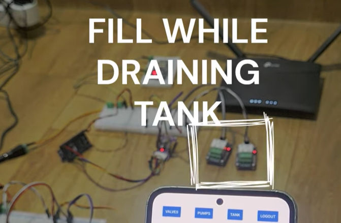
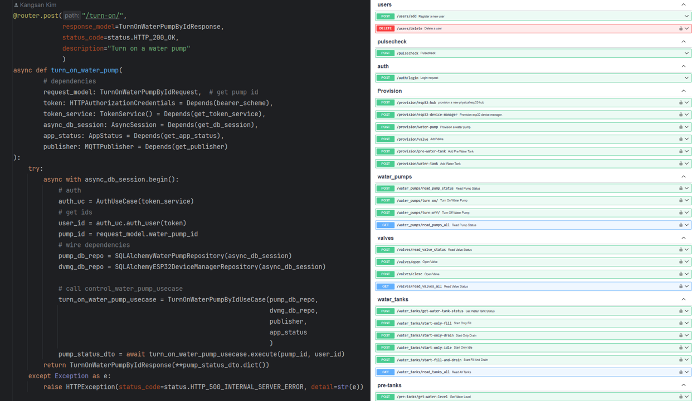
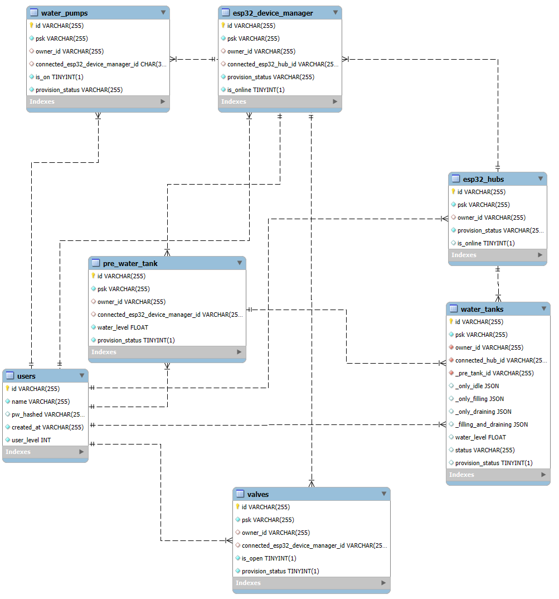
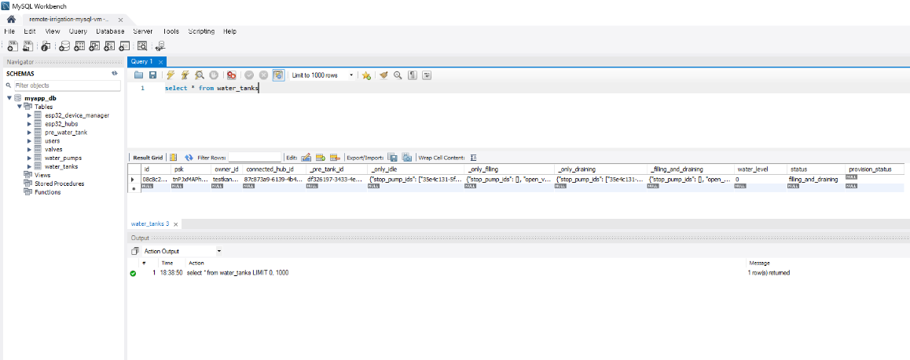
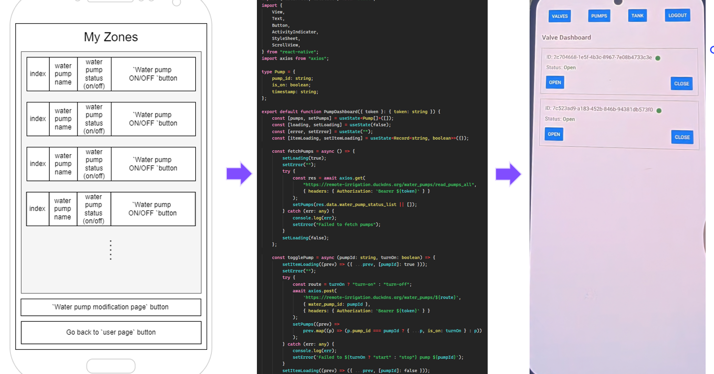
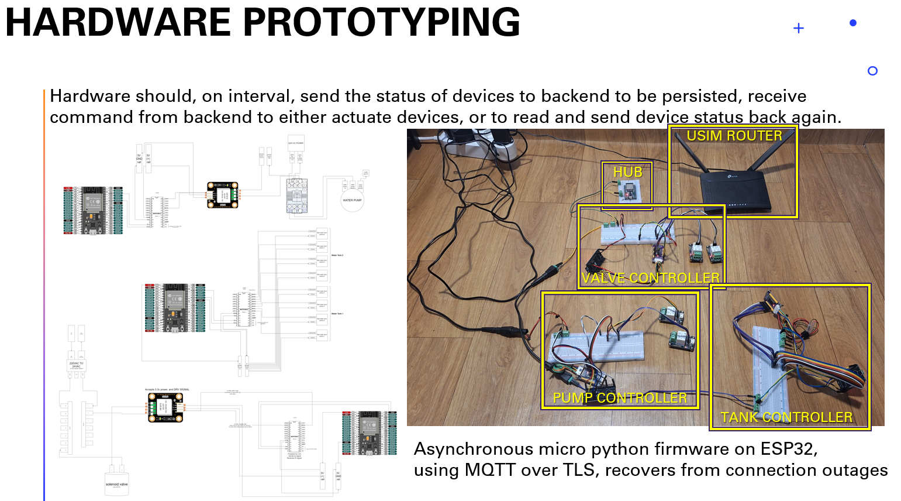
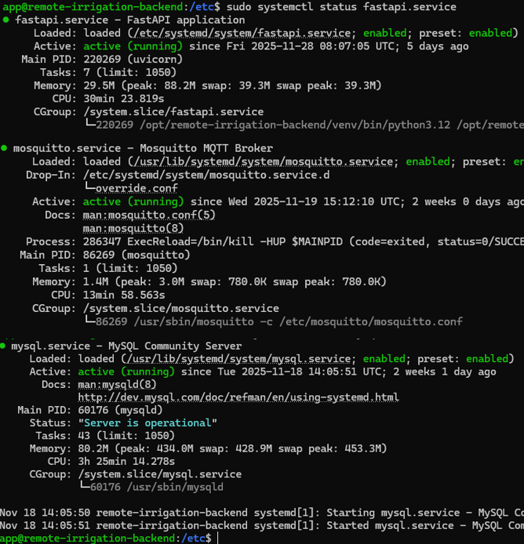

<h1 align="center">원격 관개 시스템</h1>
<p align="center">
  
</p>
<p align="center">─────────</p>
<p align="center"><strong>기존 설비를 그대로 두고도 사용할 수 있는 간단하고 안정적인 농업용 IoT 관개 플랫폼</strong></p>

<p align="center">─────────</p>

# 기능

- 🧩 탱크, 밸브, 펌프, 허브, 엣지 컨트롤러의 간단한 사용자 온보딩 및 디바이스 프로비저닝
- ⚡ 안드로이드 앱을 통한 실시간 모니터링 및 원격 제어
- 💧 설정 가능한 물탱크: 채우기, 비우기, 대기, 혹은 동시에 채우기+비우기 모드 지원
- 🔐 HTTPS + JWT 기반 인증으로 안전한 통신
- 🔄 전원/네트워크 단절 후 자동 재연결 및 상태 복구가 가능한 내결함성 엣지 디바이스

# 데모 영상
<p align="center">
  <a href="https://www.youtube.com/shorts/RhWYphY1hrE" target="_blank" rel="noopener">
    
  </a>
  <br>
  <em>이미지를 클릭하면 데모 영상을 볼 수 있습니다.</em>
</p>

# 목차

- 요약
- 아키텍처
- 상세 설명
- 파일 구조

# 요약
**Remote Irrigation**은 일반 농장의 물탱크, 밸브, 펌프를 인터넷으로 제어 가능한 스마트 자산으로 바꿔주는 IoT 플랫폼입니다.

**주요 특징**
- 실제 마이크로컨트롤러 하드웨어 사용
- 전국 어디서나 테스트 완료된 <3초 이내 실시간 작동
- 정전/Wi-Fi 단절에도 살아남음 (자동 재연결 + 상태 복구)
- 종단간 보안: HTTPS, JWT, Private CA를 사용한 MQTT over TLS

사용자는 계정을 만들고, 몇 초 만에 물리 디바이스(밸브, 펌프, 수위 센서 등)를 등록한 뒤, 안드로이드 앱으로 실시간 모니터링 및 펌프·밸브·탱크를 제어할 수 있습니다. 심지어 물 채우기와 비우기를 동시에 수행할 수도 있습니다.

모든 펌웨어, 백엔드, 프론트엔드는 처음부터 직접 개발했으며, 서버는 클라우드 Ubuntu VM에 **실제 운영 중**이며 언제든 사용자 등록이 가능합니다.

# 아키텍처
<p align="center">
  
  <br>
  <em>전체 고수준 아키텍처(C2)</em>
</p>

세 가지 주요 구성 요소:
- 엣지 디바이스 → ESP32 + MicroPython (Hub + Device Manager 패턴)
- Ubuntu VM (Vultr $7/월) → FastAPI + Mosquitto + MySQL + Nginx
- 프론트엔드 → 독립형 React Native 안드로이드 앱

## 기술 스택
| 구성 요소               | 선택 기술                                    | 선택 이유                                  |
| ----------------------- | -------------------------------------------- | ----------------------------------------- |
| 호스팅                  | Vultr $7/월 VM                               | 저렴하고 간단하며 안정적, 고정 공인 IP 제공 |
| 리버스 프록시           | Nginx + Let’s Encrypt                        | HTTPS, 속도 제한                           |
| 개방 포트               | 443 (HTTPS) + 8883 (MQTT/TLS)만 개방         | 보안성과 예측 가능성                        |
| 백엔드                  | FastAPI + async SQLAlchemy                   | 최신, 빠름, 비동기, 자동 문서 우수          |
| 아키텍처                | 간소화된 DDD 계층 구조                        | 확장성 좋고 가독성 높음                     |
| 데이터베이스            | MySQL                                        | 간단하고 async Python 지원 우수             |
| 메시지 브로커           | Mosquitto MQTT                               | 가볍고 안정적, MicroPython 지원 뛰어남      |
| 엣지 ↔ 클라우드 보안    | MQTT over TLS + username/pw + Private CA     | 보안성 높고 메모리 500KB에서도 동작         |
| 클라이언트 ↔ 클라우드 보안 | JWT + HTTPS                                | 간단한 JWT 기반 인증                       |
| 배포                    | systemd 서비스                                | 크래시 시 자동 재시작                       |

# 상세 설명

## 백엔드
<p align="center">
  
  <br>
  <em>예시 API 엔드포인트와 Swagger 문서 스크린샷</em>
</p>

**FastAPI**가 핵심 백엔드이며, 간소화된 도메인 주도 설계(DDD) 구조를 따릅니다. 요청은 **Pydantic**으로 검증 → **application → domain → infrastructure** 계층을 비동기로 거쳐 처리되고, 적절한 예외 처리 후 응답을 반환합니다.

**MySQL**은 주요 DB로 사용되며, **SQLAlchemy async**로 비동기 접근합니다. 도메인 애그리게이트 상태는 여기에 영구 저장되며, 실시간 디바이스 텔레메트리보다 약간 지연된 “지연된 진실 공급원” 역할을 합니다.

**Mosquitto MQTT**는 엣지-클라우드 통신용 메시지 브로커로, 가볍고 안정적이며 메모리가 제한된 ESP32의 MicroPython에서도 완벽히 동작합니다.

## ERD

<p align="center">
  
  <br>
  <em>엔티티 관계 다이어그램</em>
</p>

데이터베이스 스키마를 나타내며, 대부분 one-to-many 관계입니다.

<p align="center">
  <br>
  
    <br>
    <em>실제 운영 서버에서 실행한 SQL 쿼리 결과</em>
</p>

실제 운영 중인 VM에서 일시적으로 원격 DB 접근을 허용한 뒤, 로컬에서 SSL 터널링 후 실행한 `select * from water_tanks` 결과입니다.

## 프론트엔드
<p align="center">
  
    <br>
  <em>와이어프레임 → 코드 → 실제 동작</em> 
</p>

React Native (TypeScript)로 간단한 프론트엔드를 제작했으며, 독립형 안드로이드 앱으로 배포됩니다. 앱은 Ubuntu VM에 공개된 API 엔드포인트와 통신합니다.

## 엣지 디바이스
<p align="center">
  
    <br>
    <em>ESP32 실제 하드웨어</em> 
</p>

**엣지 디바이스**는 MicroPython 비동기 루프와 예외 처리가 적용된 ESP32입니다.  
두 가지 유형이 있습니다:
- **Hub** 타입: 다른 디바이스를 관리
- **Device Manager** 타입: 실제 액추에이터/센서 제어

모든 엣지 디바이스는 중앙 Mosquitto 브로커와만 통신합니다. (현재는 연결 관리를 단순하게 유지하기 위함)

엣지 ↔ Mosquitto 통신은 **MQTT over TLS**이며, Private CA와 개별 MQTT 클라이언트별 username/password를 사용합니다.

## 배포 현황
<p align="center">
  
    <br>
    <em>sudo systemctl status ~.service 스크린샷</em>   
</p>

**도메인**은 DuckDNS로 운영 중입니다.

**서버**는 Vultr의 Ubuntu VM (월 ~7달러)에 호스팅되며, FastAPI 앱, MySQL, Mosquitto 브로커가 **systemd 서비스**로 데몬 실행 중입니다.

**Nginx**는 리버스 프록시 역할을 하며, IP당 30req/s 속도 제한, Let’s Encrypt HTTPS, 포트는 443(HTTPS)과 8883(MQTT over TLS)만 개방되어 있습니다.

# 백엔드 파일 구조
```
backend/
└── src/
    ├── api/
    │   └── v1/
    │       ├── mappers/
    │       │   └── provision.py
    │       └── routes/
    │           ├── auth.py
    │           ├── farms.py
    │           ├── health.py
    │           ├── pre_tanks.py
    │           ├── provision.py
    │           ├── pulsecheck_route.py
    │           ├── users.py
    │           ├── valves.py
    │           ├── water_pumps.py
    │           └── water_tanks.py
    ├── application/
    │   ├── services/
    │   │   ├── app_status_service.py
    │   │   ├── check_admin_service.py
    │   │   ├── client_service.py
    │   │   ├── http_bearer_service.py
    │   │   ├── mqtt_tls_service.py
    │   │   ├── mqtt_topic_manager_service.py
    │   │   ├── password_service.py
    │   │   ├── ProvisionService.py
    │   │   ├── pump_app_service.py
    │   │   ├── token_service.py
    │   │   ├── valve_app_service.py
    │   │   └── water_tank_application_service.py
    │   ├── auth_usecase.py
    │   ├── ESP32DeviceManagerUseCase.py
    │   ├── ESP32HubUseCase.py
    │   ├── GetUserDevicesIdListUseCase.py
    │   ├── LoginUseCase.py
    │   ├── PreWaterTankUseCase.py
    │   ├── ProvisionUseCase.py
    │   ├── UserUseCase.py
    │   ├── ValveUseCase.py
    │   ├── WaterPumpUseCase.py
    │   └── WaterTankUseCase.py
    ├── domain/
    │   ├── interfaces/
    │   │   ├── mqtt/
    │   │   │   └── water_tank_reader.py
    │   │   ├── esp32_device_manager_repo.py
    │   │   ├── esp32_hub_repo.py
    │   │   ├── password_service_repo.py
    │   │   ├── pre_water_tank_repo.py
    │   │   ├── user_repo.py
    │   │   ├── valve_repo.py
    │   │   ├── water_pump_repo.py
    │   │   └── water_tank_repo.py
    │   ├── model/
    │   │   ├── esp32_device_manager.py
    │   │   ├── esp32_hub.py
    │   │   ├── pre_water_tank.py
    │   │   ├── user.py
    │   │   ├── valve.py
    │   │   ├── water_pump.py
    │   │   └── water_tank.py
    │   ├── services/
    │   │   └── water_tank_domain_service.py
    │   ├── value_objects/
    │   │   ├── datatypes.py
    │   │   ├── password.py
    │   │   └── user_devices_id_list.py
    │   └── Exceptions.py
    ├── infrastructure/
    │   ├── db/
    │   │   ├── db_async/
    │   │   │   └── session.py
    │   │   ├── mappers/
    │   │   │   ├── esp32_device_manager_mapper.py
    │   │   │   ├── esp32_hub_mapper.py
    │   │   │   ├── pre_water_tank_mapper.py
    │   │   │   ├── user_mapper.py
    │   │   │   ├── valve_mapper.py
    │   │   │   ├── water_pump_mapper.py
    │   │   │   └── water_tank_mapper.py
    │   │   ├── models/
    │   │   │   ├── esp32_device_manager.py
    │   │   │   ├── esp32_hub.py
    │   │   │   ├── pre_water_tank.py
    │   │   │   ├── user.py
    │   │   │   ├── valve.py
    │   │   │   ├── water_pump.py
    │   │   │   └── water_tank.py
    │   │   ├── repository/
    │   │   │   ├── sqlalchemy_esp32_device_manager_repository.py
    │   │   │   ├── sqlalchemy_esp32_repository.py
    │   │   │   ├── sqlalchemy_pre_water_tank_repository.py
    │   │   │   ├── sqlalchemy_user_repository.py
    │   │   │   ├── sqlalchemy_valve_repository.py
    │   │   │   ├── sqlalchemy_water_pump_repository.py
    │   │   │   └── sqlalchemy_water_tank_repository.py
    │   │   ├── base.py
    │   │   └── create_tables.py
    │   ├── mqtt/
    │   │   ├── app_status.py
    │   │   ├── mesage_router.py
    │   │   ├── mqtt_client.py
    │   │   ├── mqtt_message_handlers.py
    │   │   └── mqtt_publisher.py
    │   └── security/
    │       ├── pw_hasher.py
    │       ├── random_key_generator.py
    │       └── token_service.py
    ├── schemas/
    │   ├── dto/
    │   │   ├── auth.py
    │   │   ├── pre_tank.py
    │   │   ├── provision.py
    │   │   ├── users.py
    │   │   ├── valve.py
    │   │   ├── water_pump.py
    │   │   ├── water_tank.py
    │   │   └── water_tank_control.py
    │   └── http/
    │       └── v1/
    │           ├── login.py
    │           ├── pre_tanks.py
    │           ├── provision.py
    │           ├── pulsecheck.py
    │           ├── users.py
    │           ├── valves.py
    │           ├── water_pumps.py
    │           └── water_tanks.py
    └── tests/
        └── unit/
            ├── application/
            │   ├── LoginUseCase.py
            │   └── mqtt_water_tank_reader.py
            └── infrastructure/
                └── db/
                    ├── sqlalchemy_user_repository.py
                    └── sqlalchemy_valve_repository.py
    main.py
```
읽어주셔서 감사합니다!! 
